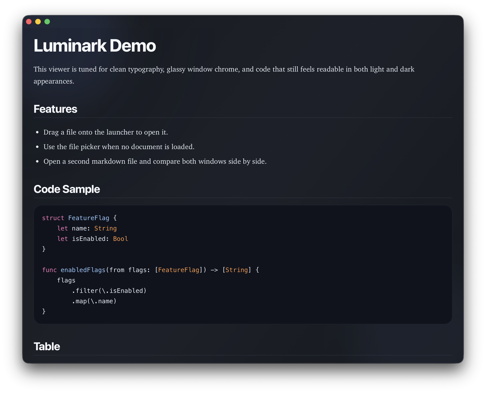

# Luminark

Luminark is a native macOS markdown reader with glassy window chrome, dark and light themes, strong typography, syntax-highlighted code blocks, drag-and-drop file opening, and focused multi-window reading.

## Preview



## Highlights

- Native macOS app built with SwiftUI and WebKit
- Opens markdown from the CLI, file picker, or drag and drop
- Each markdown file opens in its own independent window
- Theme, transparency, and reading size persist across relaunches
- Smooth in-page anchor navigation and scroll-to-top control
- Syntax-highlighted code, polished tables, quotes, and rich markdown styling

## Installation

### Download a release

Download the latest packaged app from the [GitHub Releases page](https://github.com/goosefraba/luminark/releases).

- Apple Silicon Macs: use the `arm64` build
- Intel Macs: use the `x86_64` build

The current releases are not Developer ID signed or notarized yet.

- If macOS blocks the app on first launch, right-click `Luminark.app` and choose `Open`
- If needed, use `System Settings > Privacy & Security > Open Anyway`
- Terminal fallback:

```bash
xattr -dr com.apple.quarantine /Applications/Luminark.app
```

### Run from source

```bash
swift run Luminark
```

Open a file immediately:

```bash
swift run Luminark -- Examples/demo.md
```

### Requirements

- macOS 15 or newer
- Xcode 26.3 or newer
- Swift 6.2 or newer

## Usage

- Launch without arguments to get the drop zone / file picker launcher.
- Launch with one or more markdown file paths to open them directly.
- Drop a markdown file onto the launcher or directly onto an already open rendered document.
- Hover near the top-right area of a viewer window to reveal reader controls.

## Open Source

Luminark is released under the MIT License. See [LICENSE](LICENSE).

Latest release downloads are published on the [Releases page](https://github.com/goosefraba/luminark/releases).

Contributions, bug reports, and feature suggestions are welcome:

- Read [CONTRIBUTING.md](CONTRIBUTING.md)
- Use the issue templates for bugs and feature requests
- Open pull requests against `main`

## Development

```bash
swift build
```

The app is a Swift Package. Main sources live in `Sources/LuminarkApp`.
